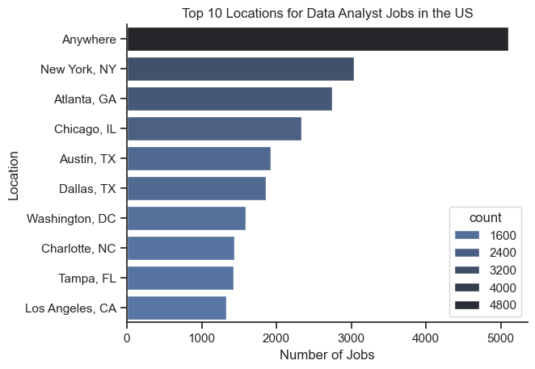
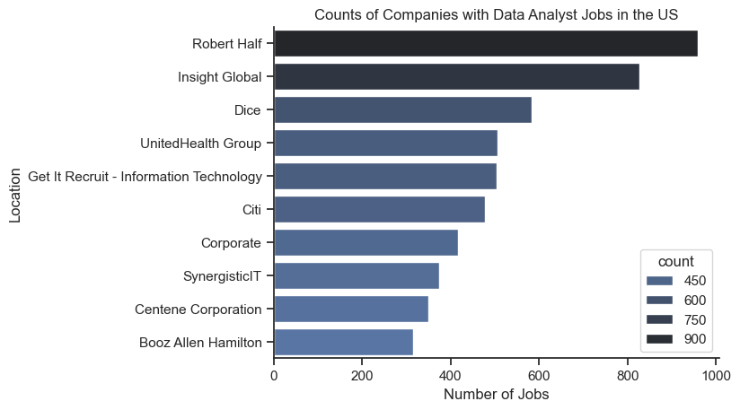
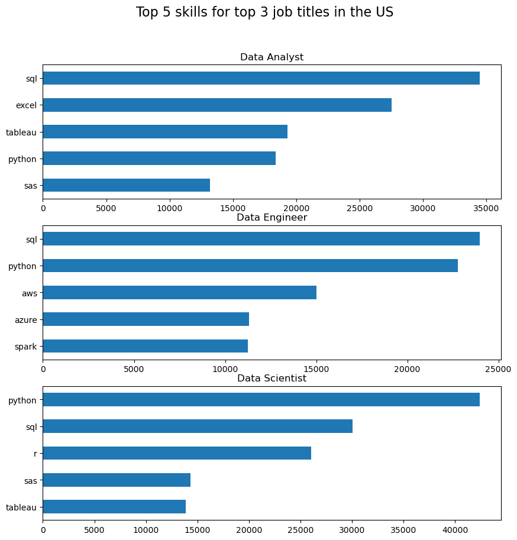
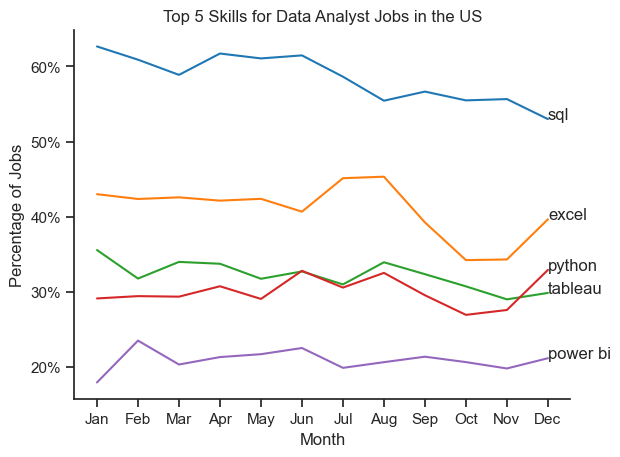
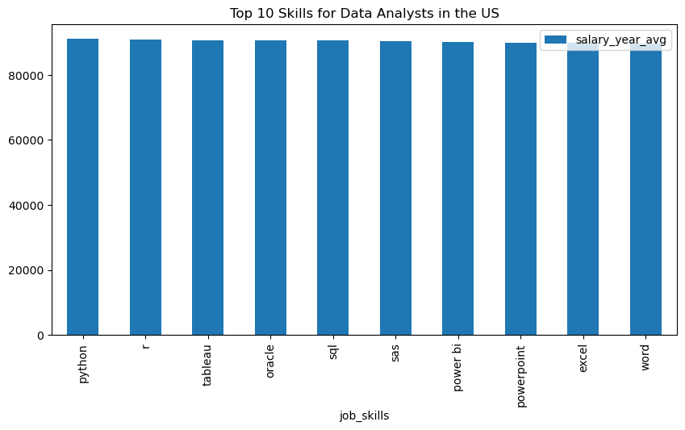

## Project Overview
This project demonstrates my Python skills by analyzing job postings data to uncover key insights and trends. The project follows the Ask, Prepare, Process, Analyze methodology to ensure a structured approach to data analysis.

## Ask

### Business Problem:
- What are the locations in the US that have the highest demand for Data Analysts?
- What are the most in demand skills for a Data Analyst in the US?
- What are the most optimal skills based on both demand and salary?
- What is the average salary expectation by skills for Data Analysts in the US?

## Prepare

### Dataset Information:
- **Source:** Job postings database
- **Description:** Contains job postings with company details, salary information, job locations, and schedules.

### Data Cleaning Considerations:
- Filtering for relevant job titles and locations
- Removing records with missing salary data or filling in NAN values with Median/Mean data
- Standardizing job location formats

## Process

## EDA

```python
#import libraries
import ast
import pandas as pd
import seaborn as sns
from datasets import load_dataset
import matplotlib.pyplot as plt

#load data and basic cleaning
dataset = load_dataset('lukebarousse/data_jobs')
df= dataset['train'].to_pandas()

df['job_posted_date'] = pd.to_datetime(df['job_posted_date'])
df['job_skills'] = df['job_skills'].apply(lambda x:ast.literal_eval(x) if pd.notna(x) else x)

#filter data and plot
df_DA_US = df[(df['job_country']=='United States') & (df['job_title_short']=='Data Analyst')] 
df_plot = df_DA_US['job_location'].value_counts().head(10).to_frame()

sns.set_theme(style="ticks")
sns.barplot(data=df_plot, x='count', y='job_location', hue='count', palette='dark:b_r')
sns.despine()
plt.title('Top 10 Locations for Data Analyst Jobs in the US')
plt.xlabel('Number of Jobs')
plt.ylabel('Location')
plt.show()

df_DA_US = df[(df['job_country']=='United States') & (df['job_title_short']=='Data Analyst')] 
df_plot = df_DA_US['company_name'].value_counts().head(10).to_frame()

sns.set_theme(style="ticks")
sns.barplot(data=df_plot, x='count', y='company_name', hue='count', palette='dark:b_r')
sns.despine()
plt.title('Counts of Companies with Data Analyst Jobs in the US')
plt.xlabel('Number of Jobs')
plt.ylabel('Location')
plt.show()

```




## Skills Analysis

```python

#Most in demand skills
df_us = df[df['job_country'] == 'United States']
df_skills = df_us.explode('job_skills')
df_skills_count = df_skills.groupby(['job_skills', 'job_title_short']).size()
df_skills_count = df_skills_count.reset_index(name='skill_count')
df_skills_count.sort_values(by='skill_count', ascending=False, inplace=True)

#creating a list of top 3 jobs
job_titles= df_skills_count['job_title_short'].unique()
job_titles = sorted(job_titles[:3])
job_titles

fig, ax = plt.subplots(len(job_titles), 1)

for i, job_title in enumerate(job_titles):
    df_plot = df_skills_count[df_skills_count['job_title_short'] == job_title].head(5)
    df_plot.plot(kind='barh', x='job_skills', y='skill_count', ax=ax[i], figsize=(10, 10), title=job_title)
    ax[i].invert_yaxis()
    ax[i].set_ylabel('')
    ax[i].legend().set_visible(False)

    fig.suptitle('Top 5 skills for top 3 job titles in the US', fontsize=16)
```



## Skills Trend Analysis

```python
df_DA_US = df[(df['job_title'] == 'Data Analyst') & (df['job_country'] == 'United States')].copy()
df_DA_US['job_posted_month_no'] = df_DA_US['job_posted_date'].dt.month
df_DA_US_explode = df_DA_US.explode('job_skills')

f_DA_US_pivot = df_DA_US_explode.pivot_table(index='job_posted_month_no', columns='job_skills', aggfunc='size', fill_value=0)
df_DA_US_pivot.loc['Total'] = df_DA_US_pivot.sum()
df_DA_US_pivot = df_DA_US_pivot[df_DA_US_pivot.loc['Total'].sort_values(ascending=False).index]
df_DA_US_pivot = df_DA_US_pivot.drop('Total')

DA_totals = df_DA_US.groupby('job_posted_month_no').size()
df_DA_US_percent = df_DA_US_pivot.div(DA_totals/100, axis=0)

df_DA_US_percent = df_DA_US_percent.reset_index()
df_DA_US_percent['job_posted_month_no'] = df_DA_US_percent['job_posted_month_no'].apply(lambda x: pd.to_datetime(x, format='%m').strftime('%b'))
df_DA_US_percent = df_DA_US_percent.set_index('job_posted_month_no')
df_DA_US_percent

df_plot = df_DA_US_percent.iloc[:, :5]

sns.lineplot(data=df_plot, dashes=False, palette='tab10')
sns.set_theme(style='ticks')
sns.despine()

plt.title('Top 5 Skills for Data Analyst Jobs in the US')
plt.ylabel('Percentage of Jobs')
plt.xlabel('Month')
plt.legend().remove()

ax = plt.gca()
ax.yaxis.set_major_formatter(plt.FuncFormatter(lambda x, _: f'{int(x)}%'))

for i in range(5):
    plt.text(11, df_plot.iloc[-1, i], df_plot.columns[i],)

plt.show()
```


## Average expected salary for Data Analysts depending on skills 

```python
#filtering and cleaning data
df_DA_US = df[(df['job_country'] == 'United States') & (df['job_title_short'] == 'Data Analyst')]
salary_median = df_DA_US['salary_year_avg'].median()
df_DA_US['salary_year_avg'] = df_DA_US['salary_year_avg'].apply(lambda x: salary_median if pd.isna(x) else x)
df_DA_US_explode = df_DA_US.explode('job_skills')

#creating a list of most in demand skills and analysing salaries for those skills
top_skills = df_DA_US_explode.groupby('job_skills').count().sort_values(by='job_title', ascending=False).head(10).index.tolist()
df_DA_US_explode = df_DA_US_explode[df_DA_US_explode['job_skills'].isin(top_skills)]
df_DA_US_explode = df_DA_US_explode.groupby('job_skills').agg({'job_title':'count', 'salary_year_avg':'mean'}).sort_values(by='salary_year_avg', ascending=False).reset_index()
df_DA_US_explode.plot(x='job_skills', y='salary_year_avg', kind='bar', figsize=(10,5))
plt.title('Top 10 Skills for Data Analysts in the US')
```

